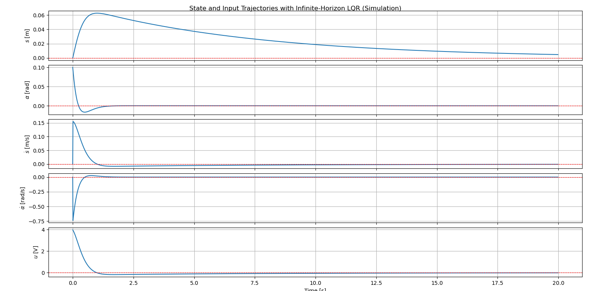
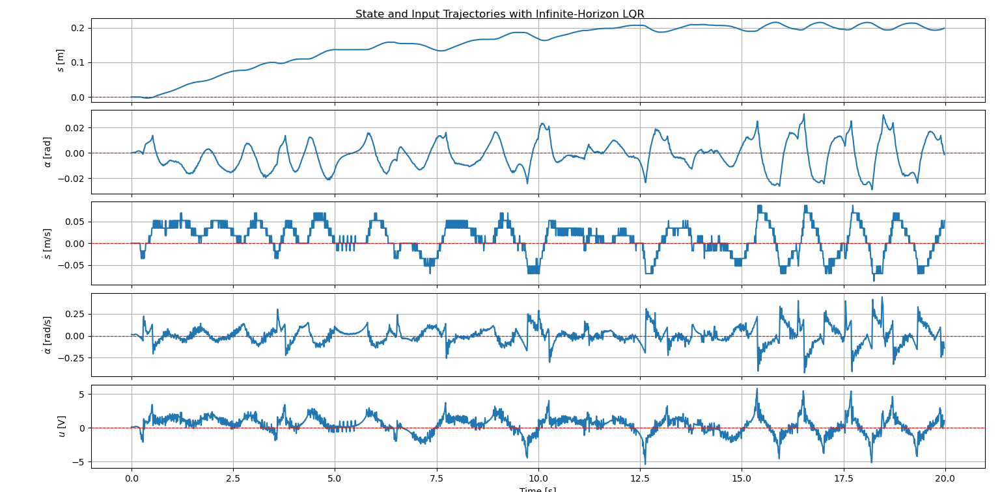
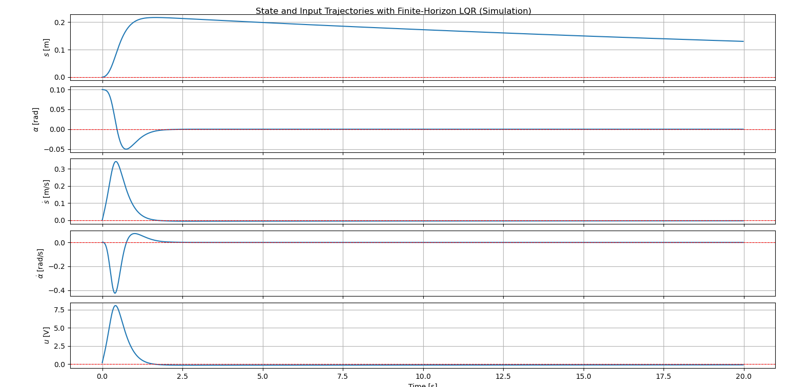
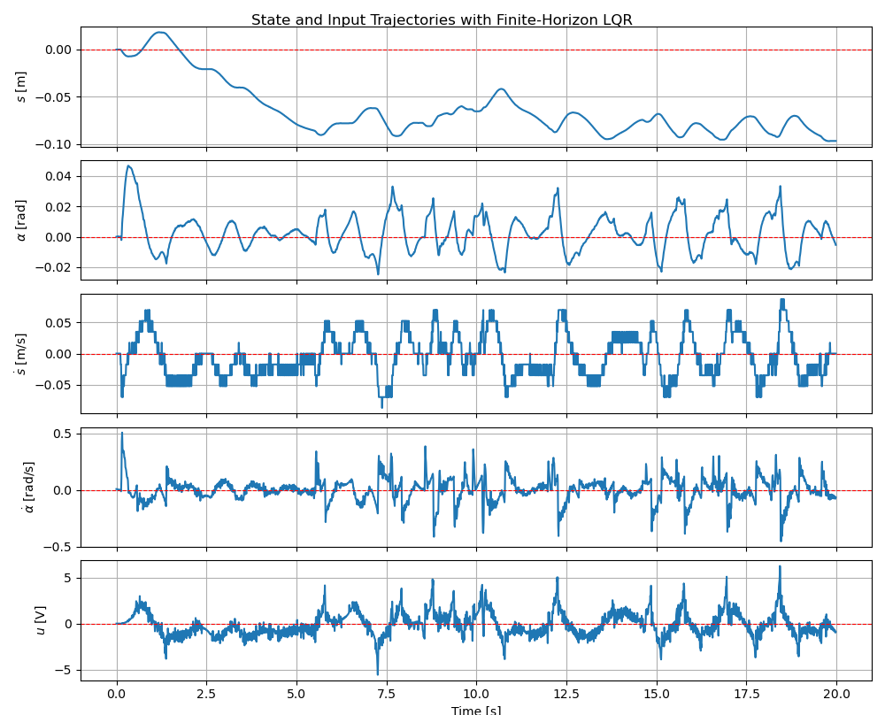
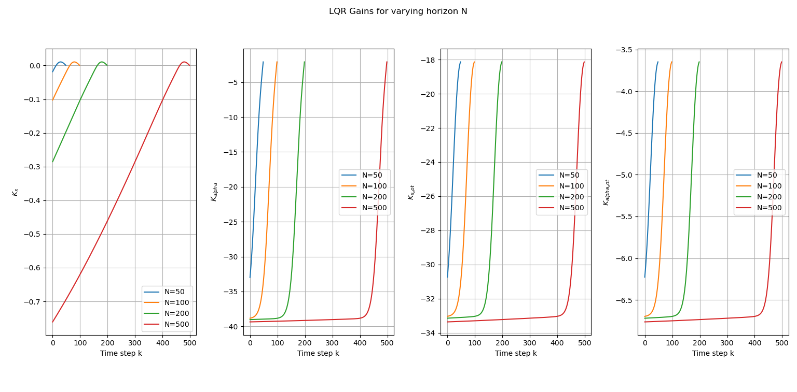
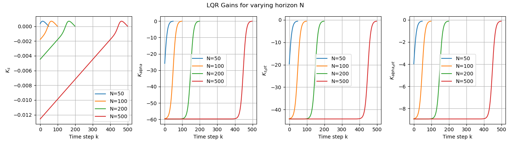
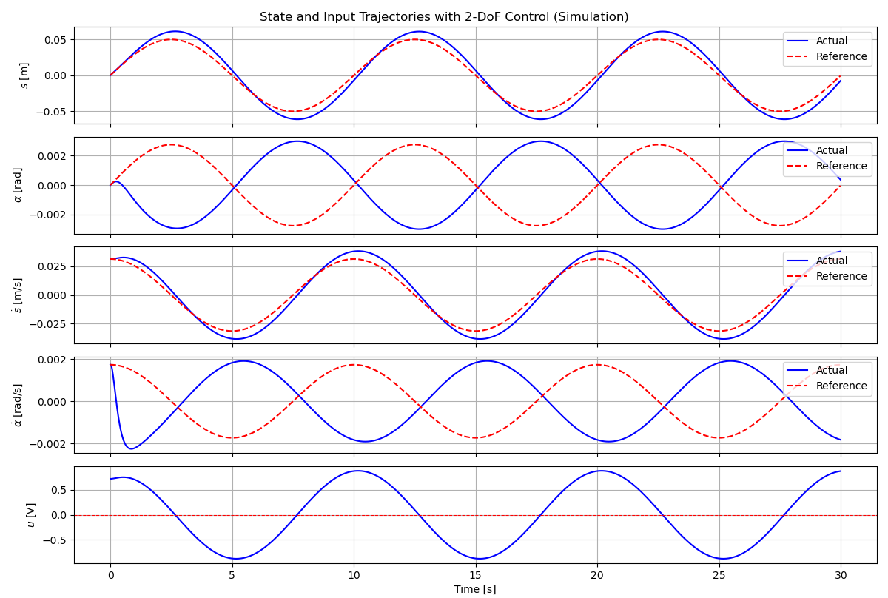
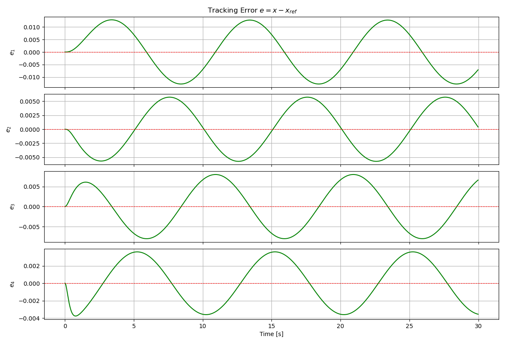
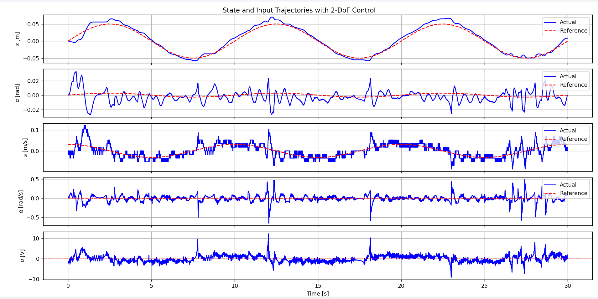
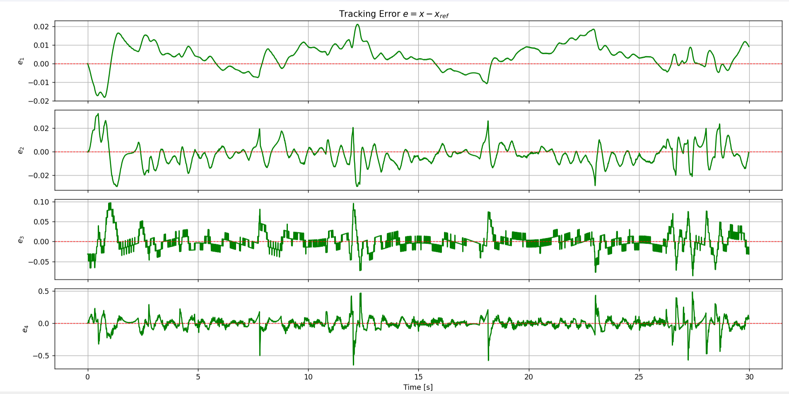

# Segway — LQR & Trajectory Tracking

Optimal control and trajectory tracking of a two-wheeled inverted-pendulum robot using nonlinear modeling, LQR, differential flatness, and real-time hardware control.

## Overview

This repository is a portfolio reconstruction of selected control-systems work developed during Control Systems Theory and Design experiments at TU Hamburg.

The project combines two related experiments on a MinSeg Segway platform:

- **CSTD II — Linear Optimal Control:** nonlinear modeling, equilibrium linearization, discretization, controllability analysis, and infinite- and finite-horizon LQR.
- **CSTD III — Flatness-Based Feedforward Control:** sinusoidal trajectory generation, differential-flatness-based state references, model-inversion feedforward, LQR feedback, and 2-DoF trajectory tracking.

The work was tested in simulation and on physical Segway hardware. The repository contains selected implementation work and generated results; original course questionnaires, templates, local configuration, and third-party libraries are intentionally excluded.

## Technical Highlights

- Nonlinear dynamic modeling with CasADi
- Linearization around the upright equilibrium
- Continuous- and discrete-time state-space models
- Zero-order-hold discretization
- Controllability analysis
- Infinite-horizon discrete-time LQR
- Finite-horizon LQR with backward Riccati recursion
- Differential-flatness-based reference generation
- Model-inversion feedforward control
- 2-DoF feedforward + feedback control
- Real-time state acquisition from encoders and IMU
- Complementary filtering for pitch-angle estimation
- PWM motor actuation
- Serial telemetry and control communication
- Real-time timing and tracking-error measurements

## Control Architecture

```text
                 Nonlinear Segway Model
                          │
                          ▼
              Linearization at Upright
                          │
                          ▼
                  Discrete State Model
                          │
             ┌────────────┴────────────┐
             │                         │
        CSTD II                    CSTD III
             │                         │
       LQR feedback          Reference trajectory
             │                         │
             │                 Differential flatness
             │                         │
             │                Feedforward control
             │                         │
             └────────────┬────────────┘
                          ▼
                  Real-Time Control
                          │
                          ▼
               MinSeg Segway Hardware
                          │
             ┌────────────┼────────────┐
             ▼            ▼            ▼
           IMU         Encoders      Motors
             │            │            │
             └────── State feedback ───┘
```

## CSTD II — Linear Optimal Control

The Segway is modeled as a four-state nonlinear system with state vector

```text
x = [s, α, ṡ, α̇]ᵀ
```

The nonlinear equations are linearized around the upright equilibrium and discretized with zero-order hold. The resulting model is used for controllability analysis and discrete-time LQR design.

Two controller formulations are included:

- **Infinite-horizon LQR:** steady-state gain obtained from the discrete algebraic Riccati equation.
- **Finite-horizon LQR:** time-varying gain sequence obtained through backward Riccati recursion.

The controller was evaluated in simulation and on the physical MinSeg platform.

## CSTD III — 2-DoF Trajectory Tracking

The second experiment extends the stabilization controller to trajectory tracking.

A sinusoidal position reference is generated and used to construct the full state reference through the Segway's flatness relationship. A model-inversion feedforward input is then combined with LQR feedback:

```text
u = u_ff + u_fb
```

where the feedback term acts on the state-tracking error.

The resulting 2-DoF controller was evaluated in simulation and on physical hardware. The tracking analysis includes state-error plots, position RMS error, and control-input RMS.

## Real-Time Hardware

The physical control setup uses an Arduino Mega-based MinSeg interface.

### State measurement

- Wheel encoder position and velocity
- MPU6050 gyroscope and accelerometer
- Gyroscope bias calibration
- Complementary filtering for pitch-angle estimation

### Actuation

- Motor direction control
- PWM-based motor command
- Voltage saturation at the hardware interface

### Communication

The Python controller exchanges binary telemetry and control packets with the Arduino over a high-speed serial connection. Packets include state measurements, control commands, timing information, and debug/status data.

## Demonstration

Two demonstration videos show the Segway control experiments on physical hardware:

- **CSTD II — LQR stabilization:** https://drive.google.com/file/d/1N_KQSugzjR1CniR6am-mq7EsozLhTLje/view?usp=sharing
- **CSTD III — 2-DoF trajectory tracking:** https://drive.google.com/file/d/18obkjl8yeSiPHbykf8dFxAB2ogvm41l-/view?usp=sharing

The videos are hosted externally because the original recordings are not stored in this repository.

## Results

### CSTD II

#### Infinite-Horizon LQR — Simulation



#### Infinite-Horizon LQR — Hardware



#### Finite-Horizon LQR — Simulation



#### Finite-Horizon LQR — Hardware



#### Finite-Horizon LQR Gains — Simulation



#### Finite-Horizon LQR Gains — Hardware



### CSTD III









## Repository Structure

```text
src/
├── model/
│   ├── segway_model.py
│   └── params.json
├── controllers/
│   ├── lqr.py
│   ├── feedforward.py
│   └── two_dof.py
├── examples/
│   ├── lqr_demo.py
│   └── tracking_demo.py
└── hardware/
    ├── python/
    │   ├── interface.py
    │   └── communication.py
    └── arduino/
        ├── include/
        ├── src/
        └── platformio.ini

results/
├── lqr-control/
└── trajectory-tracking/

docs/
└── architecture.md
```

## Software & Hardware

- Python 3.11
- NumPy / SciPy / Matplotlib
- CasADi
- Python Control Systems Library
- pySerial / pySerialTransfer
- Arduino Mega 2560
- MinSeg Segway platform
- MPU6050 IMU
- Wheel encoders

## External Dependencies

The Arduino firmware uses external libraries for the MPU6050 sensor and serial packet transfer. These dependencies are referenced through the PlatformIO configuration and are not copied into this repository.

## Course Context

Developed as part of Control Systems Theory and Design experiments at TU Hamburg.

The original university workspaces contained course questionnaires, templates, local IDE configuration, generated Python caches, and third-party libraries. These materials are intentionally excluded from this portfolio repository.

The repository does not include an open-source license because the original course materials and infrastructure are not being relicensed here.
